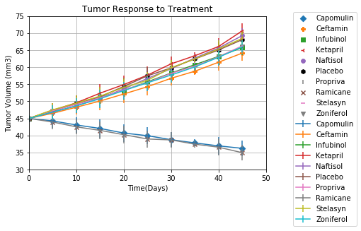
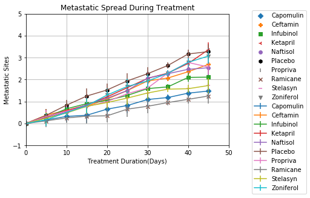
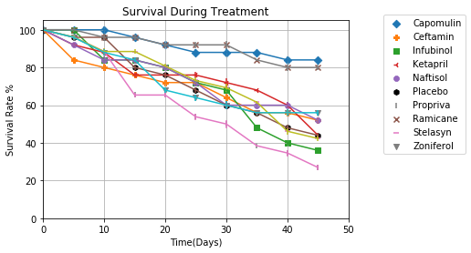
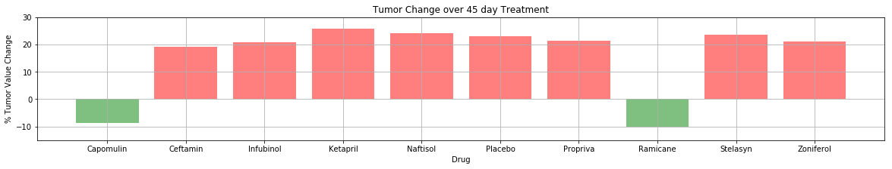

***Capomulin & Ramicane seem to be the most effective treatments, tumors shrink by approximately 10% for both treatments.
***Significant decrease in mouse survival rate, for all treatments, except for mice treated with Capomulin and Ramicane.
***Metastatic sites seem to spread for most drugs from day one, but for Capomulin and Ramicane, the spread seems to start after day 20, indicating that the number of days of treatment can affect outcomes.


```python
#Get list of files in directory
!ls
```

    Pymaceuticals.ipynb
    Pymaceuticals_Example.pdf
    raw_data
    TemperatureInWorldCities.png
    


```python
#list data files that we will be using for the homework
!ls raw_data/
```

    clinicaltrial_data.csv
    mouse_drug_data.csv
    


```python
#import libraries
import matplotlib.pyplot as plt
import numpy as np
from scipy.stats import sem
import pandas as pd
import random
```


```python
#raw_data/clinicaltrial_data.csv
#raw_data/mouse_drug_data.csv
#read in the csv files

df_clinical_trial = pd.read_csv('raw_data/clinicaltrial_data.csv')
print(df_clinical_trial.head())

df_mouse =  pd.read_csv('raw_data/mouse_drug_data.csv')
df_mouse.head()
```

      Mouse ID  Timepoint  Tumor Volume (mm3)  Metastatic Sites
    0     b128          0                45.0                 0
    1     f932          0                46.0                 0
    2     g107          0                45.0                 0
    3     a457          0                45.0                 0
    4     c819          0                45.0                 0
    


<div>
<style scoped>
    .dataframe tbody tr th:only-of-type {
        vertical-align: middle;
    }

    .dataframe tbody tr th {
        vertical-align: top;
    }

    .dataframe thead th {
        text-align: right;
    }
</style>
<table border="1" class="dataframe">
  <thead>
    <tr style="text-align: right;">
      <th></th>
      <th>Mouse ID</th>
      <th>Drug</th>
    </tr>
  </thead>
  <tbody>
    <tr>
      <th>0</th>
      <td>f234</td>
      <td>Stelasyn</td>
    </tr>
    <tr>
      <th>1</th>
      <td>x402</td>
      <td>Stelasyn</td>
    </tr>
    <tr>
      <th>2</th>
      <td>a492</td>
      <td>Stelasyn</td>
    </tr>
    <tr>
      <th>3</th>
      <td>w540</td>
      <td>Stelasyn</td>
    </tr>
    <tr>
      <th>4</th>
      <td>v764</td>
      <td>Stelasyn</td>
    </tr>
  </tbody>
</table>
</div>


```python
# Merge the two datasets on "Mouse ID" so that no data is lost
df_combined_data = pd.merge(df_clinical_trial, df_mouse,
                                 how='outer', on='Mouse ID')
df_combined_data.head(20)
```


<div>
<style scoped>
    .dataframe tbody tr th:only-of-type {
        vertical-align: middle;
    }

    .dataframe tbody tr th {
        vertical-align: top;
    }

    .dataframe thead th {
        text-align: right;
    }
</style>
<table border="1" class="dataframe">
  <thead>
    <tr style="text-align: right;">
      <th></th>
      <th>Mouse ID</th>
      <th>Timepoint</th>
      <th>Tumor Volume (mm3)</th>
      <th>Metastatic Sites</th>
      <th>Drug</th>
    </tr>
  </thead>
  <tbody>
    <tr>
      <th>0</th>
      <td>b128</td>
      <td>0</td>
      <td>45.000000</td>
      <td>0</td>
      <td>Capomulin</td>
    </tr>
    <tr>
      <th>1</th>
      <td>b128</td>
      <td>5</td>
      <td>45.651331</td>
      <td>0</td>
      <td>Capomulin</td>
    </tr>
    <tr>
      <th>2</th>
      <td>b128</td>
      <td>10</td>
      <td>43.270852</td>
      <td>0</td>
      <td>Capomulin</td>
    </tr>
    <tr>
      <th>3</th>
      <td>b128</td>
      <td>15</td>
      <td>43.784893</td>
      <td>0</td>
      <td>Capomulin</td>
    </tr>
    <tr>
      <th>4</th>
      <td>b128</td>
      <td>20</td>
      <td>42.731552</td>
      <td>0</td>
      <td>Capomulin</td>
    </tr>
    <tr>
      <th>5</th>
      <td>b128</td>
      <td>25</td>
      <td>43.262145</td>
      <td>1</td>
      <td>Capomulin</td>
    </tr>
    <tr>
      <th>6</th>
      <td>b128</td>
      <td>30</td>
      <td>40.605335</td>
      <td>1</td>
      <td>Capomulin</td>
    </tr>
    <tr>
      <th>7</th>
      <td>b128</td>
      <td>35</td>
      <td>37.967644</td>
      <td>1</td>
      <td>Capomulin</td>
    </tr>
    <tr>
      <th>8</th>
      <td>b128</td>
      <td>40</td>
      <td>38.379726</td>
      <td>2</td>
      <td>Capomulin</td>
    </tr>
    <tr>
      <th>9</th>
      <td>b128</td>
      <td>45</td>
      <td>38.982878</td>
      <td>2</td>
      <td>Capomulin</td>
    </tr>
    <tr>
      <th>10</th>
      <td>f932</td>
      <td>0</td>
      <td>46.000000</td>
      <td>0</td>
      <td>Ketapril</td>
    </tr>
    <tr>
      <th>11</th>
      <td>g107</td>
      <td>0</td>
      <td>45.000000</td>
      <td>0</td>
      <td>Ketapril</td>
    </tr>
    <tr>
      <th>12</th>
      <td>g107</td>
      <td>5</td>
      <td>48.791665</td>
      <td>0</td>
      <td>Ketapril</td>
    </tr>
    <tr>
      <th>13</th>
      <td>g107</td>
      <td>10</td>
      <td>53.435987</td>
      <td>0</td>
      <td>Ketapril</td>
    </tr>
    <tr>
      <th>14</th>
      <td>g107</td>
      <td>15</td>
      <td>58.135545</td>
      <td>0</td>
      <td>Ketapril</td>
    </tr>
    <tr>
      <th>15</th>
      <td>g107</td>
      <td>20</td>
      <td>62.706031</td>
      <td>0</td>
      <td>Ketapril</td>
    </tr>
    <tr>
      <th>16</th>
      <td>g107</td>
      <td>25</td>
      <td>64.663626</td>
      <td>0</td>
      <td>Ketapril</td>
    </tr>
    <tr>
      <th>17</th>
      <td>g107</td>
      <td>30</td>
      <td>69.160520</td>
      <td>0</td>
      <td>Ketapril</td>
    </tr>
    <tr>
      <th>18</th>
      <td>g107</td>
      <td>35</td>
      <td>71.905117</td>
      <td>0</td>
      <td>Ketapril</td>
    </tr>
    <tr>
      <th>19</th>
      <td>a457</td>
      <td>0</td>
      <td>45.000000</td>
      <td>0</td>
      <td>Ketapril</td>
    </tr>
  </tbody>
</table>
</div>


```python
#Tumor Response to Treatment 
#perform a groupby on the data, on Drug and Timepoint
group_by_drug = df_combined_data.groupby(['Drug','Timepoint'])
group_by_drug

# Converting a GroupBy object into a DataFrame, and store the mean of Tumor Volume in it.
new_drug_df = pd.DataFrame(
    group_by_drug["Tumor Volume (mm3)"].mean())
new_drug_df

#present data by Drug in colums for readability and easy comparision
unstack_drug_df = new_drug_df.unstack(level='Drug')
unstack_drug_df
```


<div>
<style scoped>
    .dataframe tbody tr th:only-of-type {
        vertical-align: middle;
    }

    .dataframe tbody tr th {
        vertical-align: top;
    }

    .dataframe thead tr th {
        text-align: left;
    }

    .dataframe thead tr:last-of-type th {
        text-align: right;
    }
</style>
<table border="1" class="dataframe">
  <thead>
    <tr>
      <th></th>
      <th colspan="10" halign="left">Tumor Volume (mm3)</th>
    </tr>
    <tr>
      <th>Drug</th>
      <th>Capomulin</th>
      <th>Ceftamin</th>
      <th>Infubinol</th>
      <th>Ketapril</th>
      <th>Naftisol</th>
      <th>Placebo</th>
      <th>Propriva</th>
      <th>Ramicane</th>
      <th>Stelasyn</th>
      <th>Zoniferol</th>
    </tr>
    <tr>
      <th>Timepoint</th>
      <th></th>
      <th></th>
      <th></th>
      <th></th>
      <th></th>
      <th></th>
      <th></th>
      <th></th>
      <th></th>
      <th></th>
    </tr>
  </thead>
  <tbody>
    <tr>
      <th>0</th>
      <td>45.000000</td>
      <td>45.000000</td>
      <td>45.000000</td>
      <td>45.040000</td>
      <td>45.000000</td>
      <td>45.000000</td>
      <td>45.000000</td>
      <td>45.000000</td>
      <td>45.000000</td>
      <td>45.000000</td>
    </tr>
    <tr>
      <th>5</th>
      <td>44.266086</td>
      <td>46.503051</td>
      <td>47.062001</td>
      <td>47.389175</td>
      <td>46.796098</td>
      <td>47.125589</td>
      <td>47.248967</td>
      <td>43.944859</td>
      <td>47.527452</td>
      <td>46.851818</td>
    </tr>
    <tr>
      <th>10</th>
      <td>43.084291</td>
      <td>48.285125</td>
      <td>49.403909</td>
      <td>49.582269</td>
      <td>48.694210</td>
      <td>49.423329</td>
      <td>49.101541</td>
      <td>42.531957</td>
      <td>49.463844</td>
      <td>48.689881</td>
    </tr>
    <tr>
      <th>15</th>
      <td>42.064317</td>
      <td>50.094055</td>
      <td>51.296397</td>
      <td>52.399974</td>
      <td>50.933018</td>
      <td>51.359742</td>
      <td>51.067318</td>
      <td>41.495061</td>
      <td>51.529409</td>
      <td>50.779059</td>
    </tr>
    <tr>
      <th>20</th>
      <td>40.716325</td>
      <td>52.157049</td>
      <td>53.197691</td>
      <td>54.920935</td>
      <td>53.644087</td>
      <td>54.364417</td>
      <td>53.346737</td>
      <td>40.238325</td>
      <td>54.067395</td>
      <td>53.170334</td>
    </tr>
    <tr>
      <th>25</th>
      <td>39.939528</td>
      <td>54.287674</td>
      <td>55.715252</td>
      <td>57.678982</td>
      <td>56.731968</td>
      <td>57.482574</td>
      <td>55.504138</td>
      <td>38.974300</td>
      <td>56.166123</td>
      <td>55.432935</td>
    </tr>
    <tr>
      <th>30</th>
      <td>38.769339</td>
      <td>56.769517</td>
      <td>58.299397</td>
      <td>60.994507</td>
      <td>59.559509</td>
      <td>59.809063</td>
      <td>58.196374</td>
      <td>38.703137</td>
      <td>59.826738</td>
      <td>57.713531</td>
    </tr>
    <tr>
      <th>35</th>
      <td>37.816839</td>
      <td>58.827548</td>
      <td>60.742461</td>
      <td>63.371686</td>
      <td>62.685087</td>
      <td>62.420615</td>
      <td>60.350199</td>
      <td>37.451996</td>
      <td>62.440699</td>
      <td>60.089372</td>
    </tr>
    <tr>
      <th>40</th>
      <td>36.958001</td>
      <td>61.467895</td>
      <td>63.162824</td>
      <td>66.068580</td>
      <td>65.600754</td>
      <td>65.052675</td>
      <td>63.045537</td>
      <td>36.574081</td>
      <td>65.356386</td>
      <td>62.916692</td>
    </tr>
    <tr>
      <th>45</th>
      <td>36.236114</td>
      <td>64.132421</td>
      <td>65.755562</td>
      <td>70.662958</td>
      <td>69.265506</td>
      <td>68.084082</td>
      <td>66.258529</td>
      <td>34.955595</td>
      <td>68.438310</td>
      <td>65.960888</td>
    </tr>
  </tbody>
</table>
</div>


```python
#unstack_drug_df["Tumor Volume (mm3)"]["Capomulin"]
#gathering info on the data frame, getting ready to plot
unstack_drug_df.reindex()
unstack_drug_df.index.values
unstack_drug_df.columns
unstack_drug_df.columns.levels[1]
```


    Index(['Capomulin', 'Ceftamin', 'Infubinol', 'Ketapril', 'Naftisol', 'Placebo',
           'Propriva', 'Ramicane', 'Stelasyn', 'Zoniferol'],
          dtype='object', name='Drug')


```python
# Build a scatter plot for each Drug type's response to treatment
#generate scatter plots for each Drug
plt.scatter(unstack_drug_df.index.values, unstack_drug_df["Tumor Volume (mm3)"]["Capomulin"], marker="D")
plt.scatter(unstack_drug_df.index.values, unstack_drug_df["Tumor Volume (mm3)"]["Ceftamin"], marker="P")
plt.scatter(unstack_drug_df.index.values, unstack_drug_df["Tumor Volume (mm3)"]["Infubinol"], marker="s")
plt.scatter(unstack_drug_df.index.values, unstack_drug_df["Tumor Volume (mm3)"]["Ketapril"], marker="3")
plt.scatter(unstack_drug_df.index.values, unstack_drug_df["Tumor Volume (mm3)"]["Naftisol"], marker="8")
plt.scatter(unstack_drug_df.index.values, unstack_drug_df["Tumor Volume (mm3)"]["Placebo"], marker="h", color="black")
plt.scatter(unstack_drug_df.index.values, unstack_drug_df["Tumor Volume (mm3)"]["Propriva"], marker="|", color='grey')
plt.scatter(unstack_drug_df.index.values, unstack_drug_df["Tumor Volume (mm3)"]["Ramicane"], marker="x")
plt.scatter(unstack_drug_df.index.values, unstack_drug_df["Tumor Volume (mm3)"]["Stelasyn"], marker="_")
plt.scatter(unstack_drug_df.index.values, unstack_drug_df["Tumor Volume (mm3)"]["Zoniferol"], marker="v")

#generate error bars for each Drug scatter plot
plt.errorbar(unstack_drug_df.index.values, 
             unstack_drug_df["Tumor Volume (mm3)"]["Capomulin"], 
             yerr=unstack_drug_df.sem(axis=None, skipna=None, level=None, ddof=1, numeric_only=None))
plt.errorbar(unstack_drug_df.index.values, 
             unstack_drug_df["Tumor Volume (mm3)"]["Ceftamin"], 
             yerr=unstack_drug_df.sem(axis=None, skipna=None, level=None, ddof=1, numeric_only=None))
plt.errorbar(unstack_drug_df.index.values, 
             unstack_drug_df["Tumor Volume (mm3)"]["Infubinol"], 
             yerr=unstack_drug_df.sem(axis=None, skipna=None, level=None, ddof=1, numeric_only=None))
plt.errorbar(unstack_drug_df.index.values, 
             unstack_drug_df["Tumor Volume (mm3)"]["Ketapril"], 
             yerr=unstack_drug_df.sem(axis=None, skipna=None, level=None, ddof=1, numeric_only=None))
plt.errorbar(unstack_drug_df.index.values, 
             unstack_drug_df["Tumor Volume (mm3)"]["Naftisol"], 
             yerr=unstack_drug_df.sem(axis=None, skipna=None, level=None, ddof=1, numeric_only=None))
plt.errorbar(unstack_drug_df.index.values, 
             unstack_drug_df["Tumor Volume (mm3)"]["Placebo"], 
             yerr=unstack_drug_df.sem(axis=None, skipna=None, level=None, ddof=1, numeric_only=None))
plt.errorbar(unstack_drug_df.index.values, 
             unstack_drug_df["Tumor Volume (mm3)"]["Propriva"], 
             yerr=unstack_drug_df.sem(axis=None, skipna=None, level=None, ddof=1, numeric_only=None))
plt.errorbar(unstack_drug_df.index.values, 
             unstack_drug_df["Tumor Volume (mm3)"]["Ramicane"], 
             yerr=unstack_drug_df.sem(axis=None, skipna=None, level=None, ddof=1, numeric_only=None))
plt.errorbar(unstack_drug_df.index.values, 
             unstack_drug_df["Tumor Volume (mm3)"]["Stelasyn"], 
             yerr=unstack_drug_df.sem(axis=None, skipna=None, level=None, ddof=1, numeric_only=None))
plt.errorbar(unstack_drug_df.index.values, 
             unstack_drug_df["Tumor Volume (mm3)"]["Zoniferol"], 
             yerr=unstack_drug_df.sem(axis=None, skipna=None, level=None, ddof=1, numeric_only=None))

# Incorporate the other graph properties
plt.title("Tumor Response to Treatment")
plt.ylabel("Tumor Volume (mm3)")
plt.xlabel("Time(Days)")
plt.grid(True)
plt.legend(bbox_to_anchor=(1.1, 1.05))

plt.ylim([30,75])
plt.xlim([0,50])

# Show plot
plt.show()
```





```python
# Converting a GroupBy object into a DataFrame
meta_df = pd.DataFrame(
    group_by_drug["Metastatic Sites"].mean())
meta_df

#genrating data in format that will make it easy to plot
unstack_drug_df = meta_df.unstack(level='Drug')
unstack_drug_df
```


<div>
<style scoped>
    .dataframe tbody tr th:only-of-type {
        vertical-align: middle;
    }

    .dataframe tbody tr th {
        vertical-align: top;
    }

    .dataframe thead tr th {
        text-align: left;
    }

    .dataframe thead tr:last-of-type th {
        text-align: right;
    }
</style>
<table border="1" class="dataframe">
  <thead>
    <tr>
      <th></th>
      <th colspan="10" halign="left">Metastatic Sites</th>
    </tr>
    <tr>
      <th>Drug</th>
      <th>Capomulin</th>
      <th>Ceftamin</th>
      <th>Infubinol</th>
      <th>Ketapril</th>
      <th>Naftisol</th>
      <th>Placebo</th>
      <th>Propriva</th>
      <th>Ramicane</th>
      <th>Stelasyn</th>
      <th>Zoniferol</th>
    </tr>
    <tr>
      <th>Timepoint</th>
      <th></th>
      <th></th>
      <th></th>
      <th></th>
      <th></th>
      <th></th>
      <th></th>
      <th></th>
      <th></th>
      <th></th>
    </tr>
  </thead>
  <tbody>
    <tr>
      <th>0</th>
      <td>0.000000</td>
      <td>0.000000</td>
      <td>0.000000</td>
      <td>0.000000</td>
      <td>0.000000</td>
      <td>0.000000</td>
      <td>0.000000</td>
      <td>0.000000</td>
      <td>0.000000</td>
      <td>0.000000</td>
    </tr>
    <tr>
      <th>5</th>
      <td>0.160000</td>
      <td>0.380952</td>
      <td>0.280000</td>
      <td>0.304348</td>
      <td>0.260870</td>
      <td>0.375000</td>
      <td>0.320000</td>
      <td>0.120000</td>
      <td>0.240000</td>
      <td>0.166667</td>
    </tr>
    <tr>
      <th>10</th>
      <td>0.320000</td>
      <td>0.600000</td>
      <td>0.666667</td>
      <td>0.590909</td>
      <td>0.523810</td>
      <td>0.833333</td>
      <td>0.565217</td>
      <td>0.250000</td>
      <td>0.478261</td>
      <td>0.500000</td>
    </tr>
    <tr>
      <th>15</th>
      <td>0.375000</td>
      <td>0.789474</td>
      <td>0.904762</td>
      <td>0.842105</td>
      <td>0.857143</td>
      <td>1.250000</td>
      <td>0.764706</td>
      <td>0.333333</td>
      <td>0.782609</td>
      <td>0.809524</td>
    </tr>
    <tr>
      <th>20</th>
      <td>0.652174</td>
      <td>1.111111</td>
      <td>1.050000</td>
      <td>1.210526</td>
      <td>1.150000</td>
      <td>1.526316</td>
      <td>1.000000</td>
      <td>0.347826</td>
      <td>0.952381</td>
      <td>1.294118</td>
    </tr>
    <tr>
      <th>25</th>
      <td>0.818182</td>
      <td>1.500000</td>
      <td>1.277778</td>
      <td>1.631579</td>
      <td>1.500000</td>
      <td>1.941176</td>
      <td>1.357143</td>
      <td>0.652174</td>
      <td>1.157895</td>
      <td>1.687500</td>
    </tr>
    <tr>
      <th>30</th>
      <td>1.090909</td>
      <td>1.937500</td>
      <td>1.588235</td>
      <td>2.055556</td>
      <td>2.066667</td>
      <td>2.266667</td>
      <td>1.615385</td>
      <td>0.782609</td>
      <td>1.388889</td>
      <td>1.933333</td>
    </tr>
    <tr>
      <th>35</th>
      <td>1.181818</td>
      <td>2.071429</td>
      <td>1.666667</td>
      <td>2.294118</td>
      <td>2.266667</td>
      <td>2.642857</td>
      <td>2.300000</td>
      <td>0.952381</td>
      <td>1.562500</td>
      <td>2.285714</td>
    </tr>
    <tr>
      <th>40</th>
      <td>1.380952</td>
      <td>2.357143</td>
      <td>2.100000</td>
      <td>2.733333</td>
      <td>2.466667</td>
      <td>3.166667</td>
      <td>2.777778</td>
      <td>1.100000</td>
      <td>1.583333</td>
      <td>2.785714</td>
    </tr>
    <tr>
      <th>45</th>
      <td>1.476190</td>
      <td>2.692308</td>
      <td>2.111111</td>
      <td>3.363636</td>
      <td>2.538462</td>
      <td>3.272727</td>
      <td>2.571429</td>
      <td>1.250000</td>
      <td>1.727273</td>
      <td>3.071429</td>
    </tr>
  </tbody>
</table>
</div>


```python
# Build a scatter plot for each Drug type
plt.scatter(unstack_drug_df.index.values, unstack_drug_df["Metastatic Sites"]["Capomulin"], marker="D")
plt.scatter(unstack_drug_df.index.values, unstack_drug_df["Metastatic Sites"]["Ceftamin"], marker="P")
plt.scatter(unstack_drug_df.index.values, unstack_drug_df["Metastatic Sites"]["Infubinol"], marker="s")
plt.scatter(unstack_drug_df.index.values, unstack_drug_df["Metastatic Sites"]["Ketapril"], marker="3")
plt.scatter(unstack_drug_df.index.values, unstack_drug_df["Metastatic Sites"]["Naftisol"], marker="8")
plt.scatter(unstack_drug_df.index.values, unstack_drug_df["Metastatic Sites"]["Placebo"], marker="h", color="black")
plt.scatter(unstack_drug_df.index.values, unstack_drug_df["Metastatic Sites"]["Propriva"], marker="|", color='grey')
plt.scatter(unstack_drug_df.index.values, unstack_drug_df["Metastatic Sites"]["Ramicane"], marker="x")
plt.scatter(unstack_drug_df.index.values, unstack_drug_df["Metastatic Sites"]["Stelasyn"], marker="_")
plt.scatter(unstack_drug_df.index.values, unstack_drug_df["Metastatic Sites"]["Zoniferol"], marker="v")

#error bars for each Drug type
plt.errorbar(unstack_drug_df.index.values, 
             unstack_drug_df["Metastatic Sites"]["Capomulin"], 
             yerr=unstack_drug_df.sem(axis=None, skipna=None, level=None, ddof=1, numeric_only=None))
plt.errorbar(unstack_drug_df.index.values, 
             unstack_drug_df["Metastatic Sites"]["Ceftamin"], 
             yerr=unstack_drug_df.sem(axis=None, skipna=None, level=None, ddof=1, numeric_only=None))
plt.errorbar(unstack_drug_df.index.values, 
             unstack_drug_df["Metastatic Sites"]["Infubinol"], 
             yerr=unstack_drug_df.sem(axis=None, skipna=None, level=None, ddof=1, numeric_only=None))
plt.errorbar(unstack_drug_df.index.values, 
             unstack_drug_df["Metastatic Sites"]["Ketapril"], 
             yerr=unstack_drug_df.sem(axis=None, skipna=None, level=None, ddof=1, numeric_only=None))
plt.errorbar(unstack_drug_df.index.values, 
             unstack_drug_df["Metastatic Sites"]["Naftisol"], 
             yerr=unstack_drug_df.sem(axis=None, skipna=None, level=None, ddof=1, numeric_only=None))
plt.errorbar(unstack_drug_df.index.values, 
             unstack_drug_df["Metastatic Sites"]["Placebo"], 
             yerr=unstack_drug_df.sem(axis=None, skipna=None, level=None, ddof=1, numeric_only=None))
plt.errorbar(unstack_drug_df.index.values, 
             unstack_drug_df["Metastatic Sites"]["Propriva"], 
             yerr=unstack_drug_df.sem(axis=None, skipna=None, level=None, ddof=1, numeric_only=None))
plt.errorbar(unstack_drug_df.index.values, 
             unstack_drug_df["Metastatic Sites"]["Ramicane"], 
             yerr=unstack_drug_df.sem(axis=None, skipna=None, level=None, ddof=1, numeric_only=None))
plt.errorbar(unstack_drug_df.index.values, 
             unstack_drug_df["Metastatic Sites"]["Stelasyn"], 
             yerr=unstack_drug_df.sem(axis=None, skipna=None, level=None, ddof=1, numeric_only=None))
plt.errorbar(unstack_drug_df.index.values, 
             unstack_drug_df["Metastatic Sites"]["Zoniferol"], 
             yerr=unstack_drug_df.sem(axis=None, skipna=None, level=None, ddof=1, numeric_only=None))
# Incorporate the other graph properties
plt.title("Metastatic Spread During Treatment")
plt.ylabel("Metastatic Sites")
plt.xlabel("Treatment Duration(Days)")
plt.grid(True)
plt.legend(bbox_to_anchor=(1.1, 1.05))

plt.ylim([-1,5])
plt.xlim([0,50])

# Show plot
plt.show()
```





```python
#survival of mice
group_by_drug = df_combined_data.groupby(['Drug','Timepoint'])

# Converting a GroupBy object into a DataFrame
survival_df = pd.DataFrame(
    group_by_drug["Mouse ID"].count())

unstack_survival_df = survival_df.unstack(level='Drug')
unstack_survival_df
#sample data
unstack_survival_df["Mouse ID"]["Capomulin"][0]
```


    25


```python
# Build a scatter plot for survival rates for each drug
plt.scatter(unstack_survival_df.index.values, 
            unstack_survival_df["Mouse ID"]["Capomulin"]/unstack_survival_df["Mouse ID"]["Capomulin"][0]*100, marker="D")
plt.scatter(unstack_survival_df.index.values, 
            unstack_survival_df["Mouse ID"]["Ceftamin"]/unstack_survival_df["Mouse ID"]["Ceftamin"][0]*100, marker="P")
plt.scatter(unstack_survival_df.index.values, 
            unstack_survival_df["Mouse ID"]["Infubinol"]/unstack_survival_df["Mouse ID"]["Infubinol"][0]*100, marker="s")
plt.scatter(unstack_survival_df.index.values, 
            unstack_survival_df["Mouse ID"]["Ketapril"]/unstack_survival_df["Mouse ID"]["Ketapril"][0]*100, marker="3")
plt.scatter(unstack_survival_df.index.values, 
            unstack_survival_df["Mouse ID"]["Naftisol"]/unstack_survival_df["Mouse ID"]["Naftisol"][0]*100, marker="8")
plt.scatter(unstack_survival_df.index.values, 
            unstack_survival_df["Mouse ID"]["Placebo"]/unstack_survival_df["Mouse ID"]["Placebo"][0]*100, marker="h", color="black")
plt.scatter(unstack_survival_df.index.values, 
            unstack_survival_df["Mouse ID"]["Propriva"]/unstack_survival_df["Mouse ID"]["Propriva"][0]*100, marker="|", color='grey')
plt.scatter(unstack_survival_df.index.values, 
            unstack_survival_df["Mouse ID"]["Ramicane"]/unstack_survival_df["Mouse ID"]["Ramicane"][0]*100, marker="x")
plt.scatter(unstack_survival_df.index.values, 
            unstack_survival_df["Mouse ID"]["Stelasyn"]/unstack_survival_df["Mouse ID"]["Stelasyn"][0]*100, marker="_")
plt.scatter(unstack_survival_df.index.values, 
            unstack_survival_df["Mouse ID"]["Zoniferol"]/unstack_survival_df["Mouse ID"]["Zoniferol"][0]*100, marker="v")

# Incorporate the other graph properties
plt.title("Survival During Treatment")
plt.ylabel("Survival Rate %")
plt.xlabel("Time(Days)")
plt.grid(True)
plt.legend(bbox_to_anchor=(1.1, 1.05))

plt.ylim([0,105])
plt.xlim([0,50])

#generate error bars
plt.errorbar(unstack_survival_df.index.values, 
             unstack_survival_df["Mouse ID"]["Capomulin"]/unstack_survival_df["Mouse ID"]["Capomulin"][0]*100, 
             yerr=unstack_survival_df.sem(axis=None, skipna=None, level=None, ddof=1, numeric_only=None))
plt.errorbar(unstack_survival_df.index.values, 
             unstack_survival_df["Mouse ID"]["Ceftamin"]/unstack_survival_df["Mouse ID"]["Ceftamin"][0]*100, 
             yerr=unstack_survival_df.sem(axis=None, skipna=None, level=None, ddof=1, numeric_only=None))
plt.errorbar(unstack_survival_df.index.values, 
             unstack_survival_df["Mouse ID"]["Infubinol"]/unstack_survival_df["Mouse ID"]["Infubinol"][0]*100, 
             yerr=unstack_survival_df.sem(axis=None, skipna=None, level=None, ddof=1, numeric_only=None))
plt.errorbar(unstack_survival_df.index.values, 
             unstack_survival_df["Mouse ID"]["Ketapril"]/unstack_survival_df["Mouse ID"]["Ketapril"][0]*100, 
             yerr=unstack_survival_df.sem(axis=None, skipna=None, level=None, ddof=1, numeric_only=None))
plt.errorbar(unstack_survival_df.index.values, 
             unstack_survival_df["Mouse ID"]["Naftisol"]/unstack_survival_df["Mouse ID"]["Naftisol"][0]*100, 
             yerr=unstack_survival_df.sem(axis=None, skipna=None, level=None, ddof=1, numeric_only=None))
plt.errorbar(unstack_survival_df.index.values, 
             unstack_survival_df["Mouse ID"]["Placebo"]/unstack_survival_df["Mouse ID"]["Placebo"][0]*100, 
             yerr=unstack_survival_df.sem(axis=None, skipna=None, level=None, ddof=1, numeric_only=None))
plt.errorbar(unstack_survival_df.index.values, 
             unstack_survival_df["Mouse ID"]["Propriva"]/unstack_survival_df["Mouse ID"]["Propriva"][0]*100, 
             yerr=unstack_survival_df.sem(axis=None, skipna=None, level=None, ddof=1, numeric_only=None))
plt.errorbar(unstack_survival_df.index.values, 
             unstack_survival_df["Mouse ID"]["Ramicane"]/unstack_survival_df["Mouse ID"]["Ramicane"][0]*100, 
             yerr=unstack_survival_df.sem(axis=None, skipna=None, level=None, ddof=1, numeric_only=None))
plt.errorbar(unstack_survival_df.index.values, 
             unstack_survival_df["Mouse ID"]["Stelasyn"]/unstack_survival_df["Mouse ID"]["Stelasyn"][0]*100, 
             yerr=unstack_survival_df.sem(axis=None, skipna=None, level=None, ddof=1, numeric_only=None))
plt.errorbar(unstack_survival_df.index.values, 
             unstack_survival_df["Mouse ID"]["Zoniferol"]/unstack_survival_df["Mouse ID"]["Zoniferol"][0]*100, 
             yerr=unstack_survival_df.sem(axis=None, skipna=None, level=None, ddof=1, numeric_only=None))

# Show plot
plt.show()
```





```python
#change in tumor over 45 days
groupbydrug = df_combined_data.groupby(["Drug","Timepoint"]).mean()

#create a new data frame
tumor_change_groupby_df=pd.DataFrame({
    "Tumor Volume (mm3)":groupbydrug["Tumor Volume (mm3)"]-45
})
tumor_change_df = tumor_change_groupby_df.reset_index()
tumor_change_df
tumor_change_df_45=tumor_change_df.loc[tumor_change_df['Timepoint'] == 45]
tumor_change_df_45=tumor_change_df_45[["Drug","Tumor Volume (mm3)"]]
tumor_change_df_45
tumor_change_df_45["Positive"]=tumor_change_df_45["Tumor Volume (mm3)"]>0
tumor_change_df_45
displaydf = tumor_change_df_45.set_index("Drug")
displaydf
```


<div>
<style scoped>
    .dataframe tbody tr th:only-of-type {
        vertical-align: middle;
    }

    .dataframe tbody tr th {
        vertical-align: top;
    }

    .dataframe thead th {
        text-align: right;
    }
</style>
<table border="1" class="dataframe">
  <thead>
    <tr style="text-align: right;">
      <th></th>
      <th>Tumor Volume (mm3)</th>
      <th>Positive</th>
    </tr>
    <tr>
      <th>Drug</th>
      <th></th>
      <th></th>
    </tr>
  </thead>
  <tbody>
    <tr>
      <th>Capomulin</th>
      <td>-8.763886</td>
      <td>False</td>
    </tr>
    <tr>
      <th>Ceftamin</th>
      <td>19.132421</td>
      <td>True</td>
    </tr>
    <tr>
      <th>Infubinol</th>
      <td>20.755562</td>
      <td>True</td>
    </tr>
    <tr>
      <th>Ketapril</th>
      <td>25.662958</td>
      <td>True</td>
    </tr>
    <tr>
      <th>Naftisol</th>
      <td>24.265506</td>
      <td>True</td>
    </tr>
    <tr>
      <th>Placebo</th>
      <td>23.084082</td>
      <td>True</td>
    </tr>
    <tr>
      <th>Propriva</th>
      <td>21.258529</td>
      <td>True</td>
    </tr>
    <tr>
      <th>Ramicane</th>
      <td>-10.044405</td>
      <td>False</td>
    </tr>
    <tr>
      <th>Stelasyn</th>
      <td>23.438310</td>
      <td>True</td>
    </tr>
    <tr>
      <th>Zoniferol</th>
      <td>20.960888</td>
      <td>True</td>
    </tr>
  </tbody>
</table>
</div>


```python
# Set x axis and tick locations
x_axis = np.arange(len(tumor_change_df_45))
tick_locations = [value+0.4 for value in x_axis]
# Create a list indicating where to write x labels and set figure size to adjust for space
plt.figure(figsize=(20,3))
#plt.bar(x_axis, newnewdf["Tumor Volume (mm3)"], color='r', alpha=0.5, align="edge")
# color=data.positive.map({True: 'r', False: 'k'})
plt.bar(x_axis, tumor_change_df_45["Tumor Volume (mm3)"], 
        color=tumor_change_df_45["Positive"].map({True: 'r', False: 'g'}), alpha=0.5, align="edge")


plt.xticks(tick_locations, tumor_change_df_45["Drug"])

# Incorporate the other graph properties
plt.title("Tumor Change over 45 day Treatment")
plt.ylabel("% Tumor Value Change")
plt.xlabel("Drug")
plt.grid(True)
plt.ylim([-15,30])
```


    (-15, 30)




# hw5
